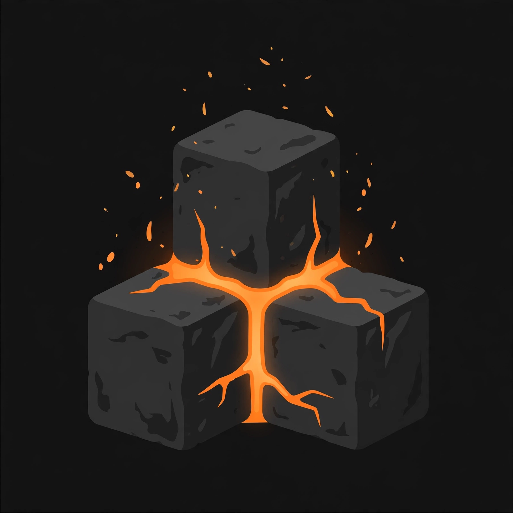

<p align="center">
  
</p>

<h1 align="center">ForgeStack</h1>

<p align="center"><i>Entity, item, XP-orb, and spawner stacking — fewer entities, zero clutter.</i></p>

<p align="center">
  
  
  
  
  
  
</p>

<p align="center"><sub>Not affiliated with <a href="https://minecraftforge.net">MinecraftForge</a> — "Forge" is just a name.</sub></p>

---

ForgeStack is an original, dependency-free Paper plugin that stacks entities, ground items, XP orbs, and mob spawners to cut server entity counts and visual clutter. Stack sizes are stored in the Persistent Data Container of a single representative entity, names render through Adventure with range-limited nameplates, and killing a stack multiplies its drops and EXP without duplicating equipment. Everything is configurable, and every user-facing string supports MiniMessage.

## Features

- **Entity stacking** — same-type mobs merge within a configurable radius, both on spawn and via a periodic world scan
- **Spawner-only mode** — optionally restrict stacking to spawner-born mobs
- **AI disabling** — non-primary members of a stack have AI disabled to cut tick cost
- **Stack counts in PDC** — no fragile metadata hacks; counts live in the Persistent Data Container
- **Range-limited nameplates** — `10x Salmon` style labels are only shown within a configurable radius and refreshed on an interval, keeping screens clean
- **Drop/EXP multiplication** — killing a stack multiplies drops and EXP by stack size, capped to prevent abuse; only genuinely stackable materials are multiplied, so a zombie's armor never duplicates
- **Item stacking** — nearby ground items of the same material merge into larger drops
- **XP orb stacking** — nearby XP orbs merge, preserving total experience
- **Spawner stacking** — stacked spawners get a floating `TextDisplay` hologram label, bonus spawns per cycle, Silk Touch break behavior, and right-click type changing with spawn eggs
- **Bypass permission** — owned/tamed entities can be excluded from stacking entirely

## Requirements

- Paper 26.3+ (`api-version: '26.3'`)
- Java 25

## Installation

1. Download `ForgeStack-1.0.0.jar` (or build it yourself, below).
2. Drop it into your server's `plugins/` folder.
3. Restart the server. A default `config.yml` is generated in `plugins/ForgeStack/`.

## Commands

All subcommands require `forgestack.admin`.

| Command | Description |
|---|---|
| `/fstack reload` | Reload `config.yml` without restarting |
| `/fstack stackall` | Force a merge scan across all worlds immediately |
| `/fstack clearall entities` | Remove all stacked entities |
| `/fstack clearall items` | Remove all dropped items |
| `/fstack givespawner <type> <count> [player]` | Give a stacked spawner item (count clamped 1–1000) |
| `/fstack info` | Show stack statistics: stacked entities, total mobs, stacked spawners |

## Permissions

| Permission | Default | Description |
|---|---|---|
| `forgestack.admin` | op | Full access to all `/fstack` commands |
| `forgestack.bypass` | false | Owned/tamed entities of players with this permission are never stacked |
| `forgestack.spawner.silktouch` | op | Breaking a stacked spawner drops its stacked spawner item |
| `forgestack.egg` | op | Right-click a spawner with a spawn egg to change its entity type |

## Configuration

All values in `plugins/ForgeStack/config.yml`. Text values support MiniMessage; `entity-name-format`, `spawner.hologram-format`, and `spawner.item-name-format` support the `<count>` and `<type>` placeholders.

| Key | Type | Default | Description |
|---|---|---|---|
| `merge-radius` | double | `5.0` | Radius in blocks within which same-type mobs merge into a stack |
| `max-stack-size` | int | `100` | Default maximum mobs per stack |
| `per-type-max` | map | `{ZOMBIE: 50}` | Per-entity-type stack size overrides |
| `no-stack-types` | list | `VILLAGER, WANDERING_TRADER, ENDER_DRAGON, WITHER, ARMOR_STAND, PLAYER` | Entity types that never stack |
| `skip-spawn-reasons` | list | `CUSTOM, COMMAND, SPAWNER_EGG` | Spawn reasons that never merge on spawn (the periodic scan can still merge them unless `spawner-only-mode` is on) |
| `spawner-only-mode` | boolean | `false` | When true, only spawner-born mobs stack |
| `entity-name-format` | string | `"<gray><count>x <white><type>"` | Display name of a stacked entity |
| `multiply-drops` | boolean | `true` | Multiply a killed stack's drops and EXP by its size |
| `max-drop-multiplier` | int | `64` | Hard cap on the drop/EXP multiplier (anti-dupe safety) |
| `item-merge-radius` | double | `3.0` | Radius in blocks within which ground items merge |
| `max-item-stack` | int | `500` | Maximum items per merged ground stack |
| `per-material-max` | map | `{}` | Per-material overrides for ground item stacks |
| `xp-merge-radius` | double | `4.0` | Radius in blocks within which XP orbs merge |
| `scan-interval-ticks` | int | `200` | How often the merge scan runs (200 ticks = 10 seconds) |
| `name-visible-range` | double | `24.0` | Distance in blocks within which a player sees stack nameplates |
| `name-visible-interval-ticks` | int | `40` | How often nameplate visibility is re-checked |
| `spawner.per-cycle-cap` | int | `4` | Extra mobs spawned per spawner cycle for a stacked spawner, beyond the vanilla one |
| `spawner.hologram-format` | string | `"<gold><count>x <type> spawner"` | Floating label above stacked spawners |
| `spawner.item-name-format` | string | `"<gold><count>x <type> Spawner"` | Name of stacked spawner items from `/fstack givespawner` |
| `spawner.break-requires-silk-touch` | boolean | `true` | When true, breaking a stacked spawner only drops its item with Silk Touch |

## Building from source

```bash
bash build.sh
```

- Requires JDK 25 (the project is built against `~/workspace/.toolchains/jdk-25.0.4.1+1`).
- Direct `javac` build against the Paper API — no build tool daemons, no extra downloads.
- Compiles with `-Werror`: warnings are errors. No deprecated APIs are used anywhere in the codebase.

## Code quality

- Every package declares `@NotNullByDefault` (JetBrains annotations, compile-time only — no runtime dependency), with explicit `@Nullable` on the handful of parameters and return values that can legitimately be null (nullable Bukkit lookups, `Map.get` passthroughs, null-returning parser fallbacks).
- Unit tests in `src/test` cover the stacking logic (`StackLogicTest`, 13 tests).

## License

Not yet chosen — contact the author before redistributing.

---

<p align="center"><i>Part of the <a href="https://github.com/ChristopherIrwin">Forge</a> plugin suite — original implementations, zero dependencies.</i></p>
